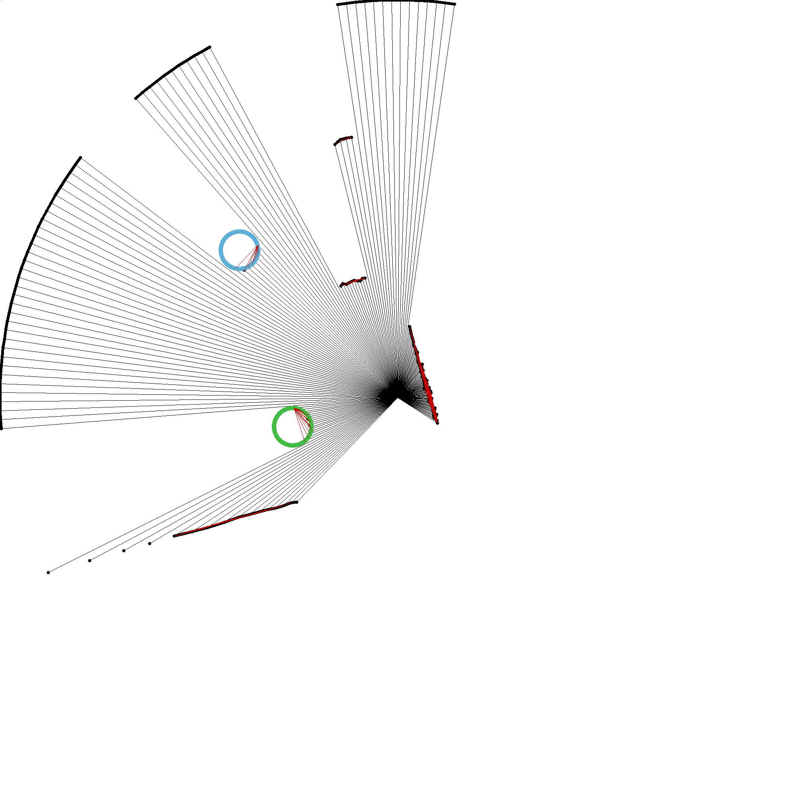

# Lidar Marble Detector

An implementation of a marble detector that uses lidar data to detect circular objects that was written to run as part of a larger project in a Gazebo simulation.

Th The implementation is environment independent as the detector accepts lidar data as an array of floats.

The purpose of the implementation is to determine the relative location of surrounding marbles only using the lidar data. The direction of the closest marble, if any, is returned.

## Demo
Here the lidar sensor is positioned in the center of the image. The sensor has a range of unit 10 and would return an 260° arc, as this is the FOV of the sensor. The circular objects are found and drawn on the image. The closest one is drawn with a green circle, the rest with a blue circle. 

The slopes that are used to determine if the line segments are straight lines or circular are also depicted on the image.

     

## Usage

```bash
$ git clone [repo] 
# update files to match project
$ mkdir build && cd build
$ cmake ..
$ make
$ ./LidarMarbleDetector
```

## More info
For more information check the excerpt from the associated [paper](ldm_paper.pdf).
